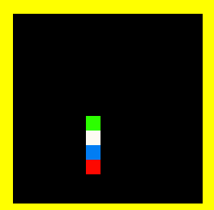

# SnakeBot

An autonomous Snake game implemented in Python using the Pygame library. This game features an AI-controlled snake that navigates the board, seeks out food, and attempts to avoid getting trapped, making decisions based on shortest path to food and safe paths to its tail.



## Table of Contents

  - [About the Game](https://www.google.com/search?q=%23about-the-game)
  - [Features](https://www.google.com/search?q=%23features)
  - [How to Run](https://www.google.com/search?q=%23how-to-run)
  - [Game Logic & AI](https://www.google.com/search?q=%23game-logic--ai)
  - [Project Structure](https://www.google.com/search?q=%23project-structure)
  - [Dependencies](https://www.google.com/search?q=%23dependencies)
  - [License](https://www.google.com/search?q=%23license)

## About the Game

"SnakeBot" is a classic Snake game where the snake's movement is entirely controlled by an artificial intelligence algorithm. Instead of player input, the snake autonomously finds its way across the grid, aiming to eat food to grow longer, while strategizing to avoid collisions with its own body or the game boundaries. The game board is a 15x15 grid, and the snake grows with each food consumed.

## Features

  * **Autonomous AI Snake:** The snake makes its own decisions without human intervention.
  * **Pathfinding Algorithm:** Utilizes a Breadth-First Search (BFS) based approach to evaluate possible moves and find paths.
  * **Smart Movement:**
      * Prioritizes the shortest path to food when it leads to a safe state (i.e., the snake can still reach its tail afterwards).
      * If a direct path to food isn't safe, it attempts to follow its tail to maintain open space and avoid being cornered.
      * Includes a fallback mechanism to take any possible safe move if other strategies fail.
  * **Simple Pygame Graphics:** Basic visual representation of the snake, food, and game board.
  * **Score Tracking:** Keeps track of the score based on eaten food.

## How to Run

To run the SnakeBot game on your local machine, follow these steps:

### Prerequisites

  * Python 3.x installed on your system.

### Installation

1.  **Install Pygame:** If you don't have Pygame installed, open your terminal or command prompt and run:
    ```bash
    pip install pygame
    ```

### Execution

1.  Save the provided Python code as a `.py` file (e.g., `robo_snake.py`).
2.  Navigate to the directory where you saved the file using your terminal or command prompt.
3.  Run the game using the Python interpreter:
    ```bash
    python robo_snake.py
    ```
4.  To exit the game, close the window or press the `ESC` key.

## Game Logic & AI

The core of the SnakeBot game lies in its intelligent movement algorithm, primarily managed by the `get_best_move` method and its helpers.

1.  **Board State Evaluation (`board_reset`, `board_refresh`):**

      * The game board is represented as a 1D array (`board`).
      * `board_reset` initializes the board, marking snake body parts as `SNAKE` and empty cells as `UNDEFINED`. The food location is marked as `FOOD`.
      * `board_refresh` performs a BFS from the `food` position to calculate the shortest distance from every reachable empty cell to the food. This creates a "distance map" on the board.

2.  **Move Selection Strategy:**

      * **Shortest Path to Food (`choose_shortest_safe_move`):** The primary goal is to find the move that leads to a cell with the minimum distance to the food (as calculated by `board_refresh`).
      * **Avoiding Traps (`find_safe_ways`, `is_tail_inside`, `virtual_shortest_move`):**
          * Before committing to the shortest path, the AI virtually simulates eating the food (`virtual_shortest_move`).
          * It then checks if, after this virtual consumption, the snake's head can still reach its tail (`is_tail_inside`). This is crucial to prevent the snake from trapping itself after eating food and growing.
      * **Following the Tail (`follow_tail`):** If the shortest path to food leads to a trap, the snake switches strategies. It tries to find the longest safe path towards its tail. This helps the snake fill empty spaces and move towards larger open areas, preventing it from getting stuck in small loops.
      * **Any Possible Move (`any_possible_move`):** As a last resort, if all other strategies fail (e.g., no safe path to food, cannot reach tail), the snake will simply take any move that doesn't immediately lead to a collision. This prevents the game from freezing.

## Project Structure

  * `Colors` class: Defines `pygame.Color` objects for various game elements.
  * `GameConstants` class: Holds constants for game dimensions, cell values, movement directions, and window size.
  * `SnakeGame` class:
      * `__init__`: Initializes Pygame, sets up the game window, and defines initial game state (snake position, food, score).
      * `_initialize_display`, `_draw_food`, `_draw_snake_part`: Handle rendering aspects.
      * `is_cell_free`, `is_move_possible`: Utility methods for checking valid game states and moves.
      * `board_reset`, `board_refresh`: Core methods for updating and evaluating the game board state (BFS).
      * `choose_shortest_safe_move`, `choose_longest_safe_move`: AI decision-making based on board distances.
      * `is_tail_inside`, `follow_tail`, `virtual_shortest_move`, `find_safe_ways`: Advanced AI logic for avoiding traps and following the tail.
      * `any_possible_move`: Fallback AI movement.
      * `shift_array`, `new_food`, `make_move`: Game mechanics for snake movement, food generation, and state updates.
      * `get_best_move`: Orchestrates the AI decision-making process.
      * `handle_events`: Handles Pygame events (quitting the game).
      * `run`: The main game loop.
  * `main()` function: Entry point for the application.

## Dependencies

  * `pygame`
  * `sys`
  * `time`
  * `random`

These are standard Python libraries and Pygame, which you'll need to install.

## License

This project is open-source and available under the MIT License.
